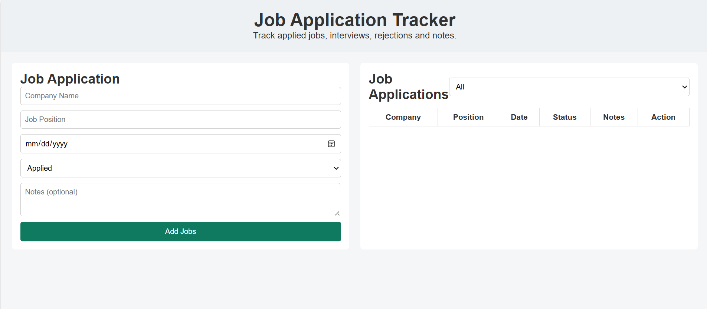
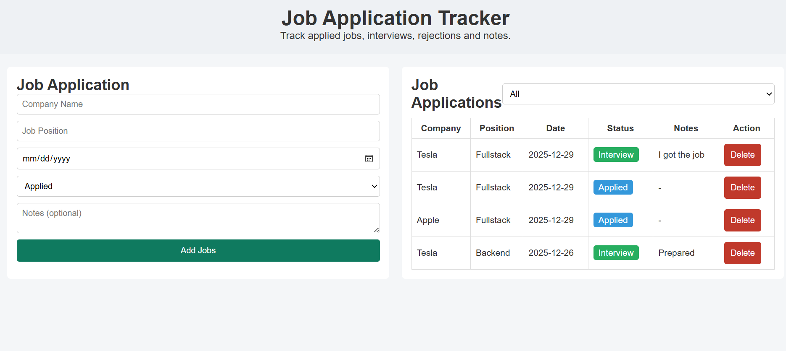

# Job Application Tracker

A simple and clean **Job Application Tracker** built with **HTML, CSS, and JavaScript**.  
It helps users track job applications, application status, dates, and notes — all stored locally in the browser.

This project demonstrates **clean code structure**, **separation of concerns**, and **real-world frontend logic**.

---

## 🔗 Live Demo
https://atupcy-dev.github.io/job-application-tracker/

---

## 📸 Screenshots
### Dashboard

### Add Job Form

---

## ✨ Features

- Add job applications
- Track job status (Applied, Interview, Rejected)
- Save application date
- Add optional notes per job
- Filter jobs by status
- Delete job entries
- Persistent data using `localStorage`
- Responsive layout (mobile & tablet)

---

## 🛠️ Technologies Used

HTML5

CSS3 (Flexbox)

Vanilla JavaScript (ES6)

Browser LocalStorage API
